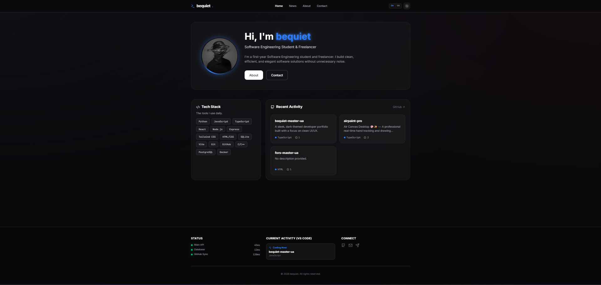

# 🚀 BeQuiet | Personal Portfolio & CMS


<div align="center">
  
  <p><i>Головна сторінка: Сучасне та динамічне портфоліо з власною системою управління контентом.</i></p>
</div>

---

## 📖 Про проєкт

**BeQuiet** — це повноцінний Full-Stack веб-застосунок, створений для презентації особистого портфоліо, публікації статей та взаємодії з користувачами. Завдяки власному бекенду на Node.js та базі даних SQLite, сайт працює як динамічна платформа з інтегрованою панеллю адміністратора (CMS), а не просто статична сторінка.

## ✨ Головні фічі

- **📝 Власна CMS (Content Management System):** Додавання, редагування та видалення статей/проєктів через захищену адмін-панель.
- **🗄️ Динамічна база даних:** Використання `better-sqlite3` для швидкого та локального зберігання даних (повідомлень та публікацій).
- **✉️ Система повідомлень:** Користувачі можуть залишати повідомлення через контактну форму, які зберігаються в базі та доступні для перегляду в адмінці.
- **🌍 Мультимовність:** Підтримка декількох мов завдяки інтеграції `i18next`.
- **📄 Автоматизація резюме:** Вбудований Python-скрипт (`generate_resume.py`) для автоматичної генерації професійного резюме у форматі `.docx`.
- **🎨 Сучасний UI/UX:** Адаптивний дизайн за допомогою Tailwind CSS, іконки Lucide та плавні анімації від Framer Motion.

## 🛠 Технологічний стек

**Frontend:**
* React 19 + TypeScript
* Vite (збірник)
* Tailwind CSS (стилізація)
* Framer Motion (анімації)
* React Router (навігація)
* React Quill (текстовий редактор для статей)
* i18next (локалізація)

**Backend & Database:**
* Node.js + Express
* SQLite3 (`better-sqlite3`)

## 🚀 Встановлення та запуск

Проєкт використовує Vite як middleware для Express у режимі розробки, що дозволяє запускати і фронтенд, і бекенд одночасно.

### 1. Клонування репозиторію
```bash
git clone [https://github.com/твоє-імя/bequiet-master-ua.git](https://github.com/твоє-імя/bequiet-master-ua.git)
cd bequiet-master-ua