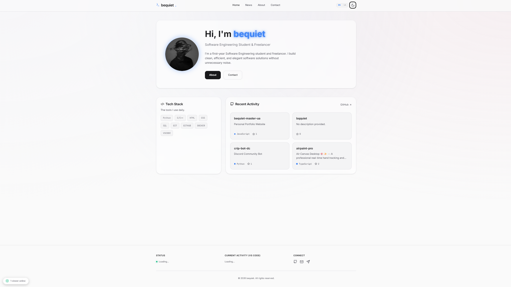
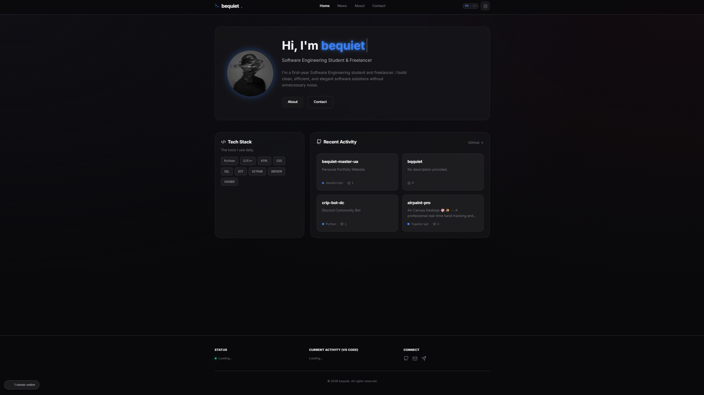

# bequiet.

Personal portfolio & blog. Built with Vanilla HTML, CSS, and JavaScript — no frameworks, no build tools.

🔗 [**Live Demo**]([https://bqquiet.github.io/bequiet-master-ua/](https://bqquiet.github.io/bequiet-master-ua/))

---

## 🎨 Interface

| Light Theme | Dark Theme |
| :---: | :---: |
|  |  |

---

## 🛠 Tech Stack

**Frontend**  
 
 
  

**Backend**  
 


**Database & Realtime**  
  


---

## 📂 Pages

* **`/` (Home)** — Bio, tech stack overview, and GitHub repository explorer.
* **`/news` (News)** — Articles, GitHub activity, and tag filters.
* **`/about` (About)** — Skills and professional timeline.
* **`/contact` (Contact)** — Links and contact form.
* **`/admin` (Admin)** — Protected panel for content management.

---

## 🚀 How to Run Locally

Clone the repository, open your terminal in the project folder, and run:

```bash
# Install dependencies
npm install

# Start the server
npm start

``` 

The app will open at [http://localhost:3000](http://localhost:3000)

---

## 📫 Contact

* **Email:** [bakalejkoandrij@gmail.com](mailto:bakalejkoandrij@gmail.com)
* **LinkedIn:** [linkedin.com/in/andrii-bakaleiko](https://linkedin.com/in/andrii-bakaleiko)
* **GitHub:** [github.com/bqquiet](https://github.com/bqquiet)

---

<div align="center">
  <b>made by <a href="https://github.com/bqquiet">bqquiet</a></b>
</div>
